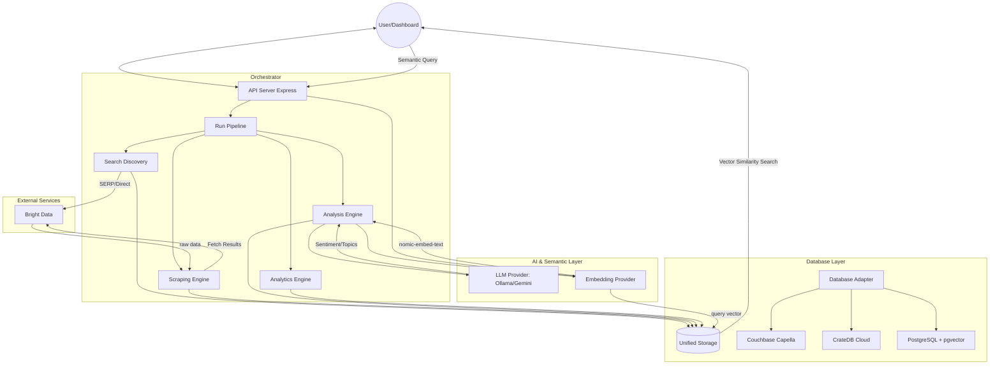

# SMLE - Unified Social Media Listening Engine 

In the world of social media analytics, "fragmentation" is the enemy. Data lives in silos. If you want to track a brand’s reputation, you’re usually toggling between a Twitter dashboard, a LinkedIn search, and a Reddit scraper, trying to mentally merge three different data formats into one coherent picture.

We decided to solve this engineering challenge by building **SMLE (Social Media Listening Engine)**.

The goal was ambitious but clear: Create a single, unified pipeline that can listen, aggregate, and analyze conversations across **Instagram, TikTok, Twitter/X, Reddit, Facebook, YouTube, and LinkedIn** simultaneously.

Here’s a look at how we architected the solution and the tech stack that powers it.

## The Architecture: A Unified Pipeline




The core philosophy behind SMLE is **"One Campaign, Any Platform."**

Instead of building seven distinct tools, we built a modular pipeline. When you initiate a search for "Generative AI," the engine spins up parallel processes. Whether the data comes from a TikTok viral video or a LinkedIn thought leadership article, it flows through the same normalization and analysis funnel.

### 1. Hybrid Data Collection Strategy
One of the biggest hurdles in social scraping is that every platform behaves differently. A "one size fits all" approach doesn't work. We implemented a hybrid strategy using **Bright Data’s infrastructure**:

*   **SERP-Based Discovery:** For platforms that are notoriously hard to search directly (like Instagram, Facebook, and LinkedIn), we leverage advanced Google SERP scraping. We construct complex search operators (e.g., `site:linkedin.com "keyword"`) to find relevant post URLs first, and then target those specific URLs for extraction.
*   **Direct Keyword Discovery:** For platforms with more open discovery mechanics (like TikTok, Reddit, and YouTube), we hit the discovery APIs directly. This is faster and yields richer initial metadata.

### 2. The Brain: Local & Cloud LLMs
Raw social data is messy. Hashtags are spammy, descriptions are full of emojis, and sentiment is hard to parse with traditional regex.

We integrated **Ollama (Local)** and **Google Gemini (Cloud)** directly into the ingestion pipeline. Every single post passes through an LLM analysis layer that:
*   **Scores Sentiment (1-10):** Not just "positive/negative," but a nuanced score based on the narrative.
*   **Extracts Topics:** It reads comments and captions to generate semantic tags (e.g., categorizing a post about "broken screens" under "hardware quality" automatically).
*   **Sanitizes Data:** It cleans up the noise, leaving us with structured, queryable JSON.

### 3. Smart Deduplication & Engagement Tracking
Social media isn't static. A post scraped today might have 10 likes; tomorrow it might have 10,000.

We built a smart deduplication system: instead of ignoring duplicate URLs, the system recognizes them. If a campaign runs and finds a post we’ve already seen:
1.  It skips the heavy re-analysis (saving compute costs).
2.  It **updates the engagement metrics** (likes, shares, comments).
3.  It logs a history of that post’s growth.

This allows users to track *velocity*—not just seeing what’s popular, but what’s *becoming* popular right now.

## The "Killer Feature": Semantic Search

This is where the tech stack really shines. Because we generate vector embeddings for every post during the analysis phase, we aren't limited to keyword searching.

We built a **Natural Language Search** interface.

Users don't have to search for "customer support" AND "fail" AND "angry." They can simply type: *"Find posts where people are complaining about shipping delays."*

The engine performs a vector similarity search against the stored embeddings across all 7 platforms. It returns posts that match the *intent* of the query, even if they don't share a single keyword.

## SMLE Vision: Deep Video Intelligence

Beyond text analysis, **SMLE Vision** provides AI-powered video content analysis for TikTok, Instagram Reels, and YouTube videos.

### How It Works

1. **Video Download**: Automatically downloads videos using platform-specific downloaders with session-based proxying via Bright Data's Scraping Browser and Web Unlocker
2. **Frame Extraction**: Extracts key frames at 1fps using FFmpeg
3. **Visual Analysis**: Each frame is analyzed using a vision-capable LLM (llava:latest via Ollama)
4. **Strategic Summary**: Aggregates frame analyses into executive summaries with:
   - Overall sentiment (positive/neutral/negative)
   - Visual themes and topics
   - Product insights and brand appearance
   - Strategic recommendations

### Key Features

- **Real-time Progress**: Terminal-style log viewer shows download and analysis progress
- **Robust Downloads**: 
  - TikTok & Instagram: Uses Scraping Browser with human-like interactions to evade bot detection
  - YouTube: Enforces single-threaded, non-chunked downloads with rate limiting
- **Smart JSON Parsing**: Automatically repairs malformed LLM responses
- **Session Persistence**: Maintains browser sessions between scraping and downloading for reliability

### Requirements

- **FFmpeg**: For video frame extraction
- **yt-dlp**: For YouTube downloads (included in project)
- **Ollama with llava**: Vision-capable model for frame analysis
- **Bright Data Credentials**:
  - Scraping Browser (for TikTok/Instagram)
  - Web Unlocker (for YouTube)

## Why This Matters

Most tools force you to choose between depth (deep analytics on one platform) or breadth (shallow metrics on many). SMLE proves that with the right architecture—combining SERP discovery, targeted scraping, and LLM processing—you can have both.

We can now spin up a campaign in seconds, walk away for coffee, and return to a comprehensive, AI-analyzed report on exactly what the world is saying, everywhere at once.


## Features
- **Multi-Platform Tracking**: Monitor campaigns on Instagram, TikTok, Reddit, YouTube, and more.
- **Sentiment Analysis**: Automated sentiment scoring for posts.
- **SMLE Vision**: AI-powered video content analysis with frame-by-frame insights.
- **Semantic Search**: Natural language queries across all platforms using vector embeddings.
- **Real-time Dashboard**: Visualize campaign performance and trends.
- **Self-Healing**: Automatic cleanup of stuck jobs.
- **Secure Authentication**: JWT-based auth with protected routes.

## Prerequisites

- **Node.js**: v18+
- **Database Server**: Right now we support [Couchbase](https://www.couchbase.com), [CrateDB](https://cratedb.com/) and [PostgreSQL](https://www.postgresql.org/) (with pgvector extension). Further databases can be added easily.
- **Docker**: For running PostgreSQL locally.
- **BrightData Account**: For SERP and scraping capabilities.


## Installation

1.  **Clone the repository**
    ```bash
    git clone https://github.com/mhirschberg/smle
    cd smle
    ```

2.  **Install Backend Dependencies**
    ```bash
    npm install
    ```

3.  **Install Frontend Dependencies**
    ```bash
    cd frontend
    npm install
    cd ..
    ```

## Infrastructure Start

Before running the application, you must start your chosen database.  
We recommend using a cloud instance of [Couchbase Capella](https://cloud.couchbase.com/sign-up?) or [CrateDB Cloud](https://console.cratedb.cloud/) for the easiest setup.

If you prefer running **PostgreSQL** locally via Docker:

```bash
docker-compose up -d
```

## Configuration

### Environment Variables
Copy the example file:
```bash
cp .env.example .env
```
    
Update `.env` with your:
- Database connection string and credentials
- BrightData API Key
- JWT Secret
- `ADMIN_USERNAME` and `ADMIN_PASSWORD` (Your initial login credentials)

> [!TIP]
> You can point to a specific environment file (e.g., for switching between local and cloud DBs) by using:  
> `DOTENV_CONFIG_PATH=.env.cb npm run setup:auth`

## Database Initialization
**For Couchbase:**
```bash
npm run setup:couchbase
```

**For CrateDB:**
```bash
npm run setup:cratedb
```
**For Postgres:**
```bash
npm run setup:postgres
```
    
This will:
- Create the necessary database structure and indexes.
- Create a default application user.

### Optional local LLM setup
Install [ollama](https://ollama.com/download) and run it locally:
```bash
ollama serve
```

Now pull the required models:
```bash
ollama pull llama3.2:1b
ollama pull nomic-embed-text
```

### SMLE Vision Setup (Optional)

For video analysis capabilities, install additional dependencies:

**1. Install FFmpeg**
```bash
# macOS
brew install ffmpeg

# Ubuntu/Debian
sudo apt-get install ffmpeg

# Windows
# Download from https://ffmpeg.org/download.html
```

**2. Pull Vision Model**
```bash
ollama pull llava:latest
```

**3. Configure Bright Data Proxies**

Update your `.env` with:
- `SBR_USERNAME` and `SBR_PASSWORD` - Scraping Browser credentials
- `UNLOCKER_USERNAME` and `UNLOCKER_PASSWORD` - Web Unlocker credentials

These are required for downloading videos from TikTok, Instagram, and YouTube.

### 1. Start the Backend API
In the root directory:
```bash
npm run dev
```
Server will start on `http://localhost:3001`.

### 2. Start the Frontend Dashboard
In a new terminal, navigate to `frontend`:
```bash
cd frontend
npm run dev
```
Access the dashboard at `http://localhost:5173`

## Usage

1.  **Login** using the credentials created during setup (or register a new user).
2.  **Create a Campaign**: Enter keywords and select platforms.
3.  **View Results**: The dashboard will update as data is fetched and analyzed.

## Tech Stack

- **Backend**: Node.js/Express with a Repository Pattern.
- **Database**: Couchbase, CrateDB or Postgres.
- **LLM**: Ollama or Google Gemini.
- **Frontend**: React + Vite + TailwindCSS.
